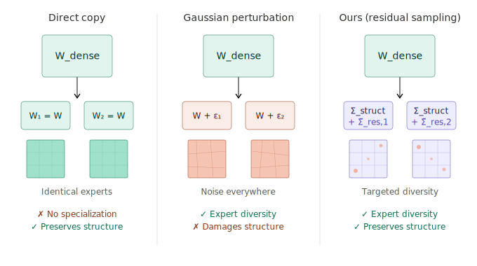

# Structure-Preserving Residual Initialization for Dense-to-MoE Upcycling

[[paper]](resource/report.pdf) [[poster]](resource/poster.pdf)

<p align="center">
  
</p>

We propose **spectral residual initialization**, which decomposes each dense weight matrix via SVD, preserves the top-*k* singular values as shared structural components, and introduces per-expert diversity only in the residual subspace. This provides expert specialization without damaging the pretrained representations.

We validate on two dense-to-MoE upcycling pairs:

| Experiment | Dense model | MoE target | Scale | Shared expert | Hardware |
| --- | --- | --- | --- | --- | --- |
| Qwen1.5 | `Qwen/Qwen1.5-1.8B` | `Qwen/Qwen1.5-MoE-A2.7B` | 1.8B → 14.3B | Yes (dim 5504) | 1× A100-80GB |
| Mixtral | `mistralai/Mistral-7B-v0.1` | `mistralai/Mixtral-8x7B-v0.1` | 7B → 46.7B | None | 8× A100-80GB |

## Results

All models are fine-tuned on the GSM8K training split (7,473 problems) and evaluated on the full GSM8K test split (1,319 problems) using 4-shot prompting with greedy decoding. Only expert FFN weights and the router are trained; all other parameters are frozen.

### Qwen1.5 (400 training steps)

| Method | Accuracy | Δ |
| --- | --- | --- |
| Dense baseline | 33.9% | — |
| **Spectral *k*=512, *s*=0.5** | **27.9%** | **+2.3%** |
| Spectral *k*=512, *s*=0.1 | 27.1% | +1.5% |
| Direct copy | 25.6% | 0.0% |
| Gaussian σ=0.5 | 25.5% | −0.1% |
| Gaussian σ=1.0 | 25.5% | −0.1% |

### Mixtral (300 training steps)

| Method | Accuracy | Δ |
| --- | --- | --- |
| **Spectral *k*=512, *s*=0.1** | **26.7%** | **+1.2%** |
| Gaussian σ=0.1 | 26.1% | +0.6% |
| Direct copy | 25.5% | 0.0% |
| Spectral *k*=512, *s*=0.5 | 18.7% | −6.8% |
| Gaussian σ=0.5 | 18.1% | −7.3% |

## Method

We convert a pretrained dense model into a Mixture-of-Experts architecture by replacing each FFN layer with routed experts. Embeddings, attention projections, and layer norms are copied directly and frozen.

The routing experts are initialized from the dense FFN weights using one of three strategies:

1. **Direct copy** — each expert receives (a partition of) the dense FFN weights
2. **Gaussian perturbation** — direct copy + i.i.d. Gaussian noise scaled by mean weight magnitude
3. **Spectral residual** — decompose W = UΣVᵀ, preserve top-*k* singular values, perturb only the residual singular values per expert: W_e = U · diag(Σ_struct + Σ̃_res,e) · Vᵀ

## Dataset

**GSM8K** ([Cobbe et al., 2021](https://arxiv.org/abs/2110.14168)): grade-school math word problems with step-by-step solutions. Full training split (7,473 problems) for fine-tuning, full test split (1,319 problems) for evaluation.

## Training Configuration

| Parameter | Qwen1.5 | Mixtral |
| --- | --- | --- |
| Training steps | 400 | 300 |
| Batch size | 1 × 4 grad. accum. | 1 × 4 grad. accum. |
| Learning rate | 5×10⁻⁴, cosine | 1×10⁻⁵, cosine |
| Warmup | 30 steps | 30 steps |
| Optimizer | AdamW (8-bit) | AdamW (8-bit) |
| Precision | bfloat16 | bfloat16 |
| Sequence length | 2048 | 2048 |
| Gradient checkpointing | Enabled | Enabled |
| Frozen parameters | Attention, embeddings, layer norms, shared expert | Attention, embeddings, layer norms |
| Hardware | 1× A100-80GB | 8× A100-80GB |

## Running the Experiments

See each experiment's README for architecture details and CLI commands:
- [`src/qwen15/README.md`](src/qwen15/README.md)
- [`src/mixtral/README.md`](src/mixtral/README.md)

```bash
# Qwen1.5 (1× A100-80GB)
bash scripts/run_qwen15.sh

# Mixtral (8× A100-80GB)
bash scripts/run_mixtral.sh
```

To run individual steps manually:

```bash
# Upcycle one method
python3 -m src.qwen15.upcycle --method svd --k 512 --svd-scale 0.5 --output /tmp/qwen-moe-svd

# Train (includes training + GSM8K eval)
python3 -m src.qwen15.train --model /tmp/qwen-moe-svd --run-name qwen-svd

# Evaluate a checkpoint standalone
python3 -m src.eval.gsm8k --model /tmp/moe-checkpoints/qwen-svd/final
```

## Project Structure

```
structural-moe-upcycling/
├── src/
│   ├── eval/
│   │   └── gsm8k.py            # GSM8K accuracy evaluation
│   ├── qwen15/
│   │   ├── upcycle.py           # 3 init methods + shared/routing expert setup
│   │   ├── train.py             # Training + GSM8K eval
│   │   └── README.md
│   └── mixtral/
│       ├── upcycle.py           # 3 init methods, full-size experts
│       ├── train.py             # Training + GSM8K eval
│       └── README.md
├── scripts/
│   ├── run_qwen15.sh
│   └── run_mixtral.sh
├── resource/
│   ├── diagram.svg
│   ├── report.pdf
│   └── poster.pdf
├── tests/
│   ├── test_inference.py
│   ├── test_data.py
│   ├── test_upcycle.py
│   └── test_train.py
├── setup.sh
├── pyproject.toml
└── README.md
```

## References

- Komatsuzaki et al., "[Sparse Upcycling: Training Mixture-of-Experts from Dense Checkpoints](https://arxiv.org/abs/2212.05055)", 2023
- Horoi et al., "[Less is More: Undertraining Experts Improves Model Upcycling](https://arxiv.org/abs/2501.18870)", 2025
- Hui et al., "[Upcycling Instruction Tuning from Dense to Mixture-of-Experts via Parameter Merging](https://arxiv.org/abs/2504.15196)", 2025
- Liew et al., "[Scaling Laws for Upcycling Mixture-of-Experts Language Models](https://arxiv.org/abs/2502.05172)", 2025
- Nakamura et al., "[Drop-Upcycling](https://arxiv.org/abs/2506.05584)", 2025
